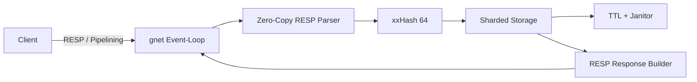

# Go High-Performance KV Store (14M+ RPS)


In-memory Key-Value хранилище на Go, реализующее протокол Redis (RESP).
Проект-исследование пределов производительности Go на Windows. Демонстрирует
эволюцию от стандартного сетевого стека до агрессивно оптимизированного
движка, выдающего 14,000,000+ RPS в пике на одной машине.

> Ключевая особенность: сервер работает в архитектуре Event-Loop (gnet),
> использует Zero-Copy парсинг и управляет памятью вручную
> (Pre-allocation, Pooling), чтобы минимизировать паузы GC.

---

## Бенчмарки 

Замеры проводились на localhost (Windows, 12 threads).
Клиент: собственный бенчмарк с поддержкой Pipelining.

| Operation | Mode | Batch Size | Throughput (RPS) | Latency (p99) |
|---|---|---|---|---|
| GET | Pipeline Max | 20,000 | 14,125,000 | 18.6 ms |
| SET | Pipeline Max | 20,000 | 6,660,000 | 70.8 ms |
| GET | Realistic | 100 | ~600,000 | 4 ms |

> *Примечание:* Высокая латентность (ms) в режиме Pipeline Max (Batch 20k) обусловлена огромным размером батча. Это сознательный компромисс для демонстрации максимальной пропускной способности (CPU Throughput) и проверки пределов движка.
>
> На Linux при малых батчах (например, 100) скорость обычно заметно выше, чем на Windows, из-за меньшей стоимости системных вызовов. При батчах 20k разница почти исчезает, так как количество syscalls минимально.

---

## Визуализация

### Архитектура (упрощенная)



### Рост производительности (этапы)


## Как я достиг 14M RPS (30k → 14M RPS)

Стартовая точка: ~30k RPS. Дальше — коротко по шагам и что именно дал прирост.

### Этап 0: Базовый сервер (~30k RPS)
Стартовая версия — стандартная модель запрос/ответ и сетевой стек без пайплайна.
Огромные задержки сети (RTT) и системные вызовы делают throughput низким.

### Этап 1: Сила протокола (30k → 400k RPS)
Проблема: процессор простаивает, ожидая сеть.  
Решение:
- Pipelining: команды отправляются пачками без ожидания ответа.
- Конфигурация: 10 клиентов, batch=100.
Результат: ~400k RPS. Узким местом стал CPU и syscalls.

### Этап 2: Massive Batching & Architecture (400k → 5M RPS)
Проблема: при 400k RPS сервер захлебывается в syscalls.  
Решение:
- Увеличение batch до 20,000.
- Smart Flush: запись в сеть только при заполнении буфера или когда входящий поток иссяк.
- Zero-Copy парсинг RESP, чтобы убрать лишние аллокации на горячем пути.
Результат: быстрый рост до 5M RPS.

### Этап 3: Zero-Copy & Low-Level Tuning (5M → 12M RPS)
Проблема: до 40% CPU уходило в GC и хеширование.  
Решение:
- xxHash + uint64: `map[string]` → `map[uint64]`, хеш считается один раз.
- Шардирование для снятия lock contention.
Результат: стабильные 10–12M RPS.

### Этап 4: Taming the Runtime (12M → 14.1M RPS)
Проблема: просадки из-за агрессивного GC и grow мап.  
Решение:
- Переход на gnet (Event-Loop вместо goroutine-per-conn).
- GOGC=1000 (редкий GC).
- Pre-allocation мап.
Результат: стабильная линия производительности в районе 14M.

### Ключевые оптимизации

**Sharding (борьба с lock contention)**
- Проблема: один глобальный мьютекс превращал все операции в очередь.
- Что сделал: разбил хранилище на шардированную карту с `sync.RWMutex` на шард.
- Результат: чтения и записи по разным ключам идут параллельно, блокировки исчезли из топа профиля.

**Zero‑Copy парсинг (борьба с аллокациями)**
- Проблема: создание строк при парсинге давало постоянный GC‑шум.
- Что сделал: zero‑copy парсер RESP и работа с буферами напрямую; позже перенёс его в gnet‑путь.
- Результат: парсинг почти исчез из профиля, GC стал заметно легче.

**Batching + Smart Flush (борьба с syscalls)**
- Проблема: `WSASend` вызывался слишком часто, CPU уходил в cgocall.
- Что сделал: буферизация ответов и flush только при заполнении буфера или окончании входящего потока.
- Результат: количество syscalls на батч сократилось на порядки.

**map[uint64] + xxHash (борьба с mapaccess_faststr)**
- Проблема: строковые ключи приводили к `mapaccess*_faststr` и `memeqbody`.
- Что сделал: перешёл на `map[uint64]*entry`, хеш считаю один раз (xxHash).
- Результат: быстрый доступ по `mapaccess*_fast64`, меньше нагрузка на GC.

**TTL + Janitor (контроль памяти)**
- Проблема: ключи жили вечно и раздували память.
- Что сделал: TTL + ленивое удаление + фоновой janitor с ограниченным сканом.
- Результат: память “пилой” стабилизируется, GC работает предсказуемее.

**Memory Recycling (борьба с churn)**
- Проблема: частое создание `entry` давало высокое давление на GC.
- Что сделал: `sync.Pool` для `entry`, переиспользование буферов и аргументов.
- Результат: меньше аллокаций, меньше пауз GC.

---

## Архитектура

- Core: Go 1.23+, unsafe, sync
- Network: gnet (Non-blocking I/O)
- Storage: In-memory Sharded Map (`map[uint64]*entry`)
- Hashing: xxhash
- Memory: `sync.Pool` для рециклинга `entry`

### Storage Design
```go
type Shard struct {
    mu      sync.RWMutex
    entries map[uint64]*entry // Быстрый доступ по хешу
}

type entry struct {
    key      string // Оригинал ключа (для коллизий)
    value    string // Значение
    expireAt int64  // TTL (Unix Nano)
    next     *entry // Linked list для разрешения коллизий
}
```

---

## Сценарии использования

Проект оптимизирован под throughput и толстые пайплайны, а не под тысячи
медленных клиентов. Подходит для:
- Sidecar Cache (localhost, 1–2 persistent соединения)
- Data Ingestion / Aggregation (батчи метрик/логов)
- HFT / Low-Latency сценарии на одном узле

---

## Поддерживаемые команды

| Команда | Описание | Пример |
|:---|:---|:---|
| `SET key value` | Установить значение ключа | `SET user:1 "John"` |
| `GET key` | Получить значение ключа | `GET user:1` |
| `INCR key` | Увеличить значение на 1 | `INCR counter` |
| `PING` | Проверка соединения | `PING` |
| `QUIT` / `EXIT` | Закрыть соединение | `QUIT` |
| `CONFIG GET` | Совместимость с бенчмарками | `CONFIG GET *` |

---

## Запуск и Тесты

### 1. Запуск сервера
```bash
go run ./cmd/gnet -gogc 1000 -ttl 15
```

Чтобы отключить TTL:
```bash
go run ./cmd/gnet -gogc 1000 -ttl 0
```

### 2. Запуск бенчмарка
```bash
go run -tags benchmark ./bench -pipeline-only -pipeline-batch 20000
```

---

## Performance Breakdown (pprof)

Типичная картина на пике:
- ~40% — `runtime.mapaccess1_fast64` (доступ к RAM / L3 Cache)
- ~15% — `runtime.scanobject` (GC проверяет указатели)
- ~10% — syscall (Windows I/O overhead)
- ~5% — `sync.RWMutex` (блокировки шардов)

> Узкое место — скорость RAM и реализация map в Go.
> Сетевой слой и парсинг занимают менее 15% времени.

---
